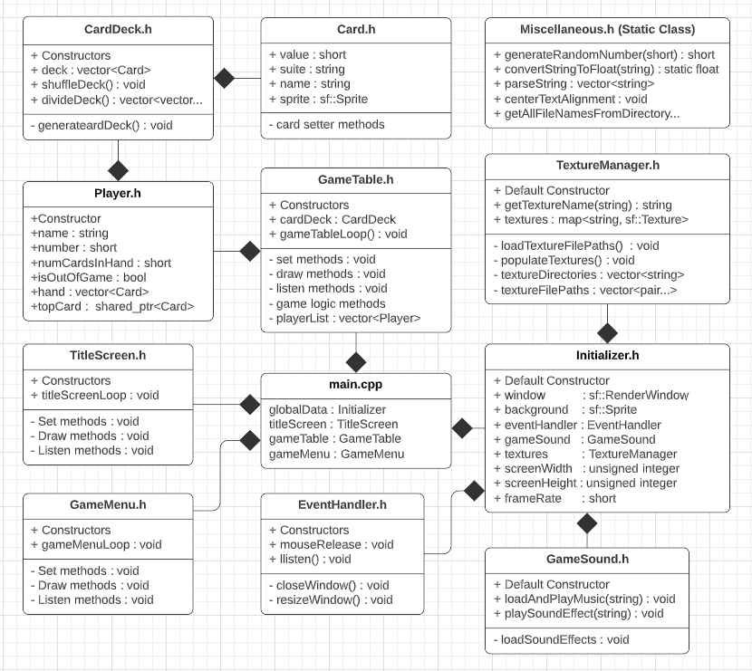

<h1>Egyptian Rat (Under Development)</h1>

<b>DESCRIPTION:</b>

Starting with my War Card Game project, I am exanding the capabilities to play more complex games. Some of the framework has already been improved but many changes are yet to come.

<b>SCREENSHOTS:</b>
  

<b>DEPENDENCIES:</b>
<ul><li>C++ 11</li>
    <li>SFML (Get it here: https://www.sfml-dev.org/index.php)</li></ul>

<b>COMPILE INSTRUCTIONS (CMake):</b>
<ol><li>Create "Build" folder in the code directory</li>
    <li>Change directory into the "Build" folder</li>
    <li>Run command: '<b>cmake ..</b>' (auto configure) or '<b>ccmake ..</b>' (for manual configuring)  
    	If manual, configure anything needed but you should only need to add "Debug" to the blank line.
        Enter "c" to create a cmakeList.txt file. Enter "g" to finish generating and exit the gui.</li>
    <li>After the cmake files have been generated in the "Build" folder, run the command: '<b>make</b>'. 
        This will create a "Main.out" executable file in the source folder.</li>
    
*Note: Only step 4 will be needed for repeat compiles once the Build folder is created and 
        initialized. There are also scripts to assist with compiling and cleaning garbadge files.
</ol>

<b>COMPILE INSTRUCTIONS (g++):</b>
    <ul><li>If CMake isnt working, you can use the 'compileAndRun.bash' script. Just run as is.</li></ul>

<b>UML DIAGRAM:</b>

